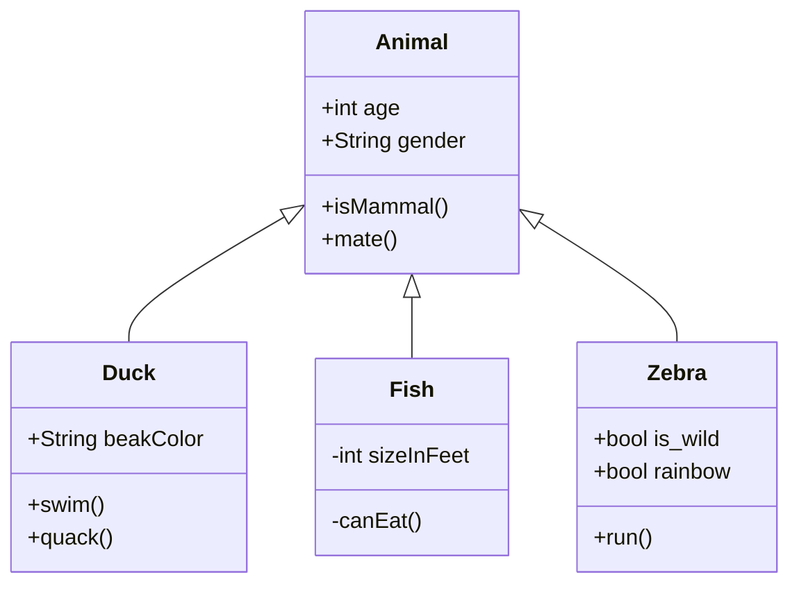

# `<code is life />`

### Interests
- Kubernetes
- Hardware (Components and such)
- Software development (Primary Web Development atm.)

---

### Toolbelt
- OS
    - Arch Linux
- IDE
    - Visual Studio Code
- Languages
    - C#
    - Typescript / Javascript
    - Python
    - PHP
- Frameworks
    - Vue (2 & 3)
    - React
    - Laravel
- Databases
    - PostgreSQL
    - MSSQL
    - MongoDB
- Server management:
    - Tofu (Terraform)
    - Ansible

## My self hosted environment

Currently i have a single VPS at Hetzner where i host Coolify, but im in currently in the progress of migrating to Kubernetes Cluster which will serve as my server environment moving forward

